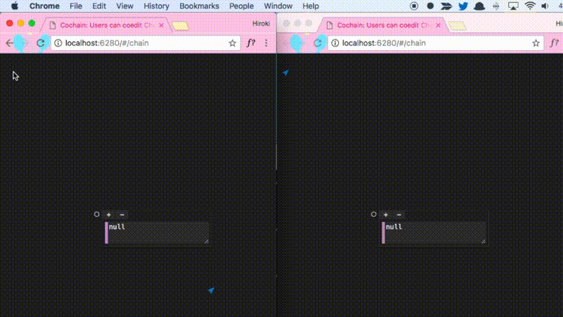

# Cochain

Cochain Allows Users to Coedit [Chain](https://github.com/mimorisuzuko/chain).



## Setup

```zsh
git clone https://github.com/mimorisuzuko/chain.git cochain
cd cochain
git checkout feature/co

# Install modules
yarn

# Run
yarn start
open http://localhost:6280
```