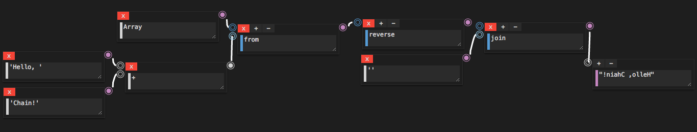

# Chain

A New Visual Programming Environment to Build JavaScript By Linking Blocks.

Also, you can coedit this by using [Cochain](https://github.com/mimorisuzuko/chain/tree/feature/co).

## Example:

`'Hello, Chain!'` => `'!niahC ,olleH'`



### JavaScript

```javascript
Array.from('Hello, ' + 'World!').reverse().join('')
```
