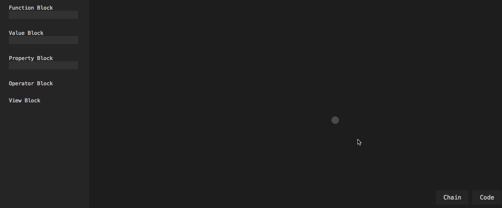

# [Chain](http://mimorisuzuko.github.io/chain/demo/)

Chain is a visual programming language that allows user to use methods of JavaScript.

## Example

### Hello, World!

### !dlroW ,olleH

## Plugin

Selecting "Code" from the two buttons on bottom, user can write JavaScript.

## Keywords

### Block

#### Function Block

指定した関数に引数など設定できるBlock

* Params Pin（白）: 引数の入力ができるPin
* Self Pin（青）: thisの入力ができるPin
* Returns Pin（桃）: 関数の返り値が出力できるPin

#### Value Block

値や変数を持つBlock

* Value Pin（白）: 値か変数を出力するPin
	* e.g.) 100, "Hello", console, Math

#### Property Block

Self PinのPropertyを取得できるBlock

* Self Pin（青）: thisの入力ができるPin
* Returns Pin（桃）: Propertyが出力できるPin

#### Operator Blcok

四則演算などができるBlock

* Params Pin（白）: 演算したい値が入力できるPin
* Returns Pin（桃）: 演算子した結果が出力できるPin

#### View Block

入力した関数などを実行し表示できるBlock

* View Pin（桃）: 表示したいものが入力できるPin

### Pin

Blockの値や実行結果などを入出力できるもの．

### Link

Pin同士を結ぶもの．

