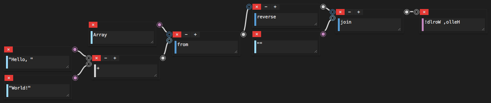

# Chain

A New Visual Programming Language to Build a Program Like JavaScript.

## Example: !dlroW ,olleH

### Chain



### JavaScript

```javascript
Array.from("Hello, " + "World!").reverse().join("")
```