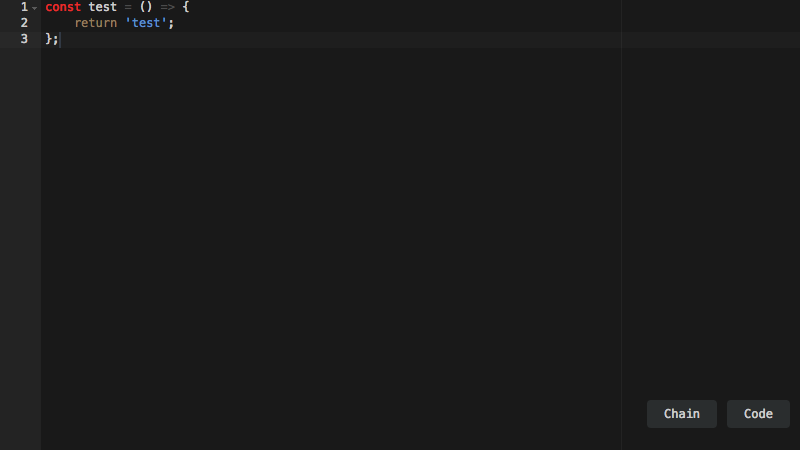
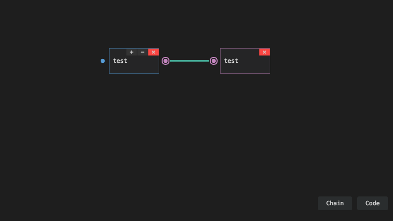

# Chain

Chain is a visual programming language that allows user to use methods of JavaScript.

## Example

### Hello, World!

### !dlroW ,olleH

### Plugin

Selecting "Code" from the two buttons on bottom, user can write JavaScript.

Then, user can use the code in Chain.

## Play Chain!