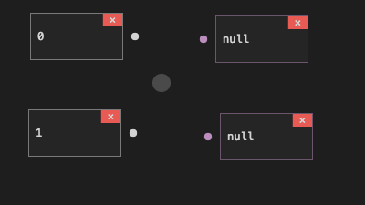
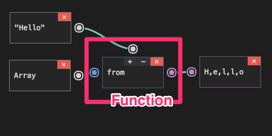
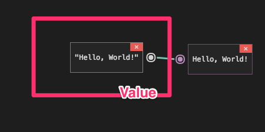
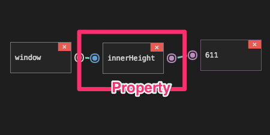
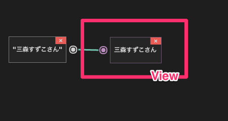

# How to use Chain

[ここ](http://mimorisuzuko.github.io/chain/play/)からChainを体験することができます．

## Add Block

右クリックすることでメニューが表示されます．ユーザはメニューから追加したいBlockを選択します．値の入力が必要なBlockであれば，入力してからBlockを追加します．

## Link Pin

1つの出力Pinに対して複数の入力Pinに繋ぐことができます．ユーザは始めたいPinからドラッグを開始し，終わりたいPinでマウスアップすることでPin同士を繋げます．

## Plugin

ユーザは下部のボタンから**Code**を選択するとJavaScriptを記述することができます．記述した後，Chain上でも記述した変数や関数を使用することができます．

## Block & Pin

それぞれのBlockとそれに付随するPinの説明です．

### Function Block

使用したい関数名を設定してから追加します．上部のボタンをクリックすることで入力できる引数を増やせます．

* Params Pin（白）: 引数の**入力**ができるPin
* Self Pin（青）: thisの**入力**ができるPin
* Returns Pin（桃）: 関数の返り値が**出力**できるPin

### Value Block

使用したい変数名や値を設定してから追加します．

e.g.) Array, 100, "Hello", []

* Value Pin（白）: 値か変数を**出力**するPin

### Property Block

キーを設定してから追加します．

e.g.) innerText, background-color

* Self Pin（青）: thisの**入力**ができるPin
* Returns Pin（桃）: Propertyが**出力**できるPin

### Operator Blcok

上部のボタンをクリックすることで演算子を切り替えられます．

* Params Pin（白）: 演算したい値が**入力**できるPin
* Returns Pin（桃）: 演算子した結果が**出力**できるPin

### View Block

Blockを実行し，その値を表示します．

* View Pin（桃）: 表示したいものが**入力**できるPin
